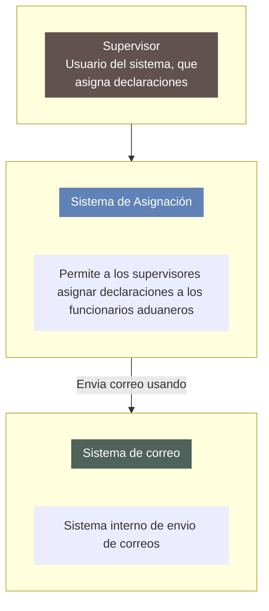

# Alcance del Sistema de Información

## Descripción

El presente sistema tiene como finalidad gestionar la **asignación automática y controlada de especialistas aduaneros** para la atención de **declaraciones de importación** que requieren ser sometidas a una **diligencia**.

Una *declaración* es el documento presentado por un **declarante** que contiene la información sobre las mercancías que desea importar. Según el canal asignado durante el proceso selectivo (naranja o rojo), la diligencia requerida puede ser:

- **Inspección documental** (canal naranja), realizada por un especialista desde un entorno de escritorio.
- **Inspección física** (canal rojo), realizada presencialmente por un funcionario en el punto de control.

### Funcionalidades incluidas:
- Registro y consulta de declaraciones asignadas para revisión.
- Asignación automática o manual de especialistas a diligencias.
- Reasignación manual de especialistas a diligencias
- Generación de trazabilidad para fines de auditoría.

## Diagrama contexto general del sistema

