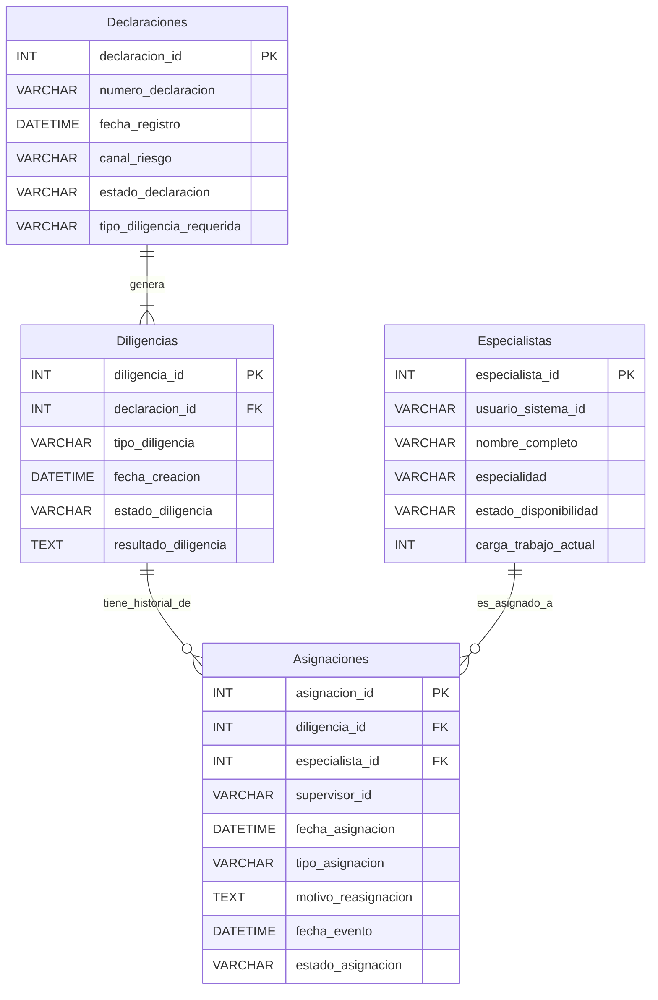

# Diseño modelo físico de datos

```mermaid
erDiagram
    Declaraciones {
        INT declaracion_id PK
        VARCHAR numero_declaracion
        DATETIME fecha_registro
        VARCHAR canal_riesgo
        VARCHAR estado_declaracion
        VARCHAR tipo_diligencia_requerida
    }

    Diligencias {
        INT diligencia_id PK
        INT declaracion_id FK
        VARCHAR tipo_diligencia
        DATETIME fecha_creacion
        VARCHAR estado_diligencia
        TEXT resultado_diligencia
    }

    Especialistas {
        INT especialista_id PK
        VARCHAR usuario_sistema_id
        VARCHAR nombre_completo
        VARCHAR especialidad
        VARCHAR estado_disponibilidad
        INT carga_trabajo_actual
    }

    Asignaciones {
        INT asignacion_id PK
        INT diligencia_id FK
        INT especialista_id FK
        VARCHAR supervisor_id
        DATETIME fecha_asignacion
        VARCHAR tipo_asignacion
        TEXT motivo_reasignacion
        DATETIME fecha_evento
        VARCHAR estado_asignacion
    }

    %% Relaciones
    Declaraciones ||--|{ Diligencias : "genera"
    Diligencias ||--o{ Asignaciones : "tiene_historial_de"
    Especialistas ||--o{ Asignaciones : "es_asignado_a"

```