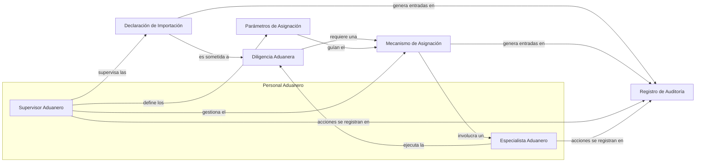

# Diagrama del modelo conceptual

```mermaid
graph LR

    Declaracion["Declaración de Importación"]
    Diligencia["Diligencia Aduanera"]
    Especialista["Especialista Aduanero"]
    Supervisor["Supervisor Aduanero"]
    Asignacion["Mecanismo de Asignación"] 
    Parametros["Parámetros de Asignación"]
    Auditoria["Registro de Auditoría"]

    %% Relaciones con descripciones y posible multiplicidad conceptual
    Declaracion -- "es sometida a" --> Diligencia
    Diligencia -- "requiere una" --> Asignacion
    Asignacion -- "involucra un" --> Especialista
    Supervisor -- "gestiona el" --> Asignacion
    Supervisor -- "define los" --> Parametros
    Parametros -- "guían el" --> Asignacion
    
    Supervisor -- "supervisa las" --> Declaracion
    Especialista -- "ejecuta la" --> Diligencia
    
    Declaracion -- "genera entradas en" --> Auditoria
    Asignacion -- "genera entradas en" --> Auditoria
    Supervisor -- "acciones se registran en" --> Auditoria
    Especialista -- "acciones se registran en" --> Auditoria

    %% Para indicar roles, podemos agrupar o simplemente relacionar
    %% pero sin herencia formal en un modelo conceptual muy alto nivel
    %% Si quisiéramos agrupar personal:
    subgraph "Personal Aduanero"
        Especialista
        Supervisor
    end

    %% Nota: Las multiplicidades exactas (1, *, 0..*) pueden omitirse en un modelo conceptual
    %% muy alto nivel si se busca simplicidad, o se pueden añadir si aportan claridad.
    %% Por ejemplo:
    %% Declaracion "1" -- "1..*" Diligencia
    %% Diligencia "1" -- "1" Asignacion

```